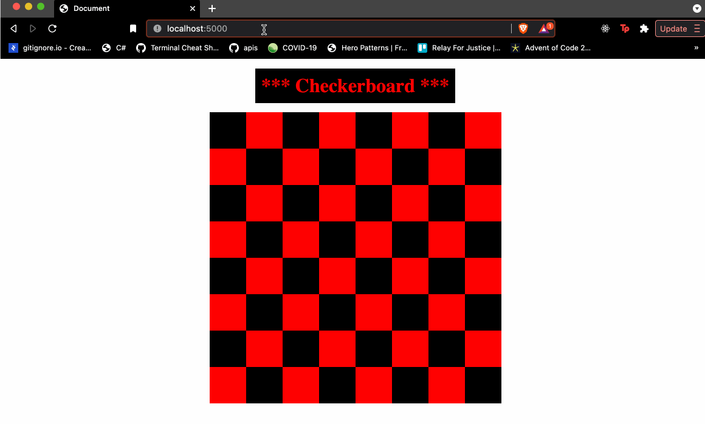
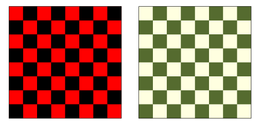

# Checkerboard

# Coding Dojo Practice 07.02.2022

 

Now let's practice linking static files to our template. For this project, we'll render a template that displays a checkerboard:

 

 

Your program should have the following output

1. http://localhost:5000 - should display 8 by 8 checkerboard
2. http://localhost:5000/4 - should display 8 by 4 checkerboard
3. http://localhost:5000/(x)/(y) - NINJA BONUS: Have another route accept 2 parameters (i.e. "/<x>/<y>") and render a checkerboard with x rows and y columns, with alternating colors
4. SENSEI BONUS: Have another route accept 4 parameters (i.e. "/<x>/<y>/<color1>/<color2>") and render a checkerboard with x rows and y columns, with alternating colors, color1 and color2

 

**HINT: Remember that values from urls come in as strings by default. If you want to use the value in a loop, you should convert it to an integer before passing it to Jinja.**

